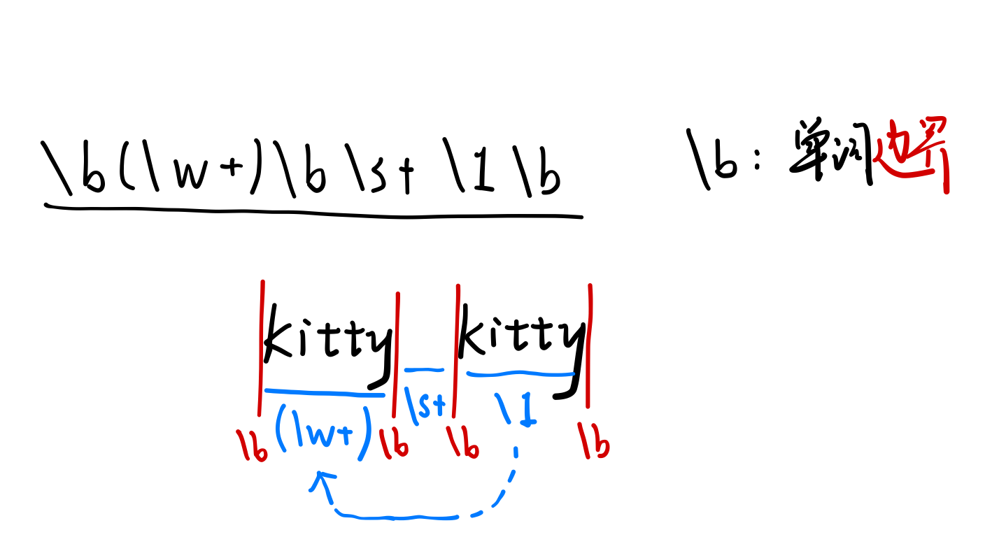

# 正则表达式

## 三种模式

- 匹配
- 搜索
- 替换

## 匹配

- **字符代表其本身**  
  > The car parked in **the** garage.
- **转义字符**  
  > \n、\t etc
- **特殊匹配字符** 
  > ^字符串开头  
  $字符串结尾  

### 字符簇 [ ]

- **匹配的*****单个*****字符在某个范围中**
- - [aeiou]
- - [a-z]
- - [0-9]
- **范围取反**
- - [^a-z] 匹配所有非小写字母的单个字符
- - [^c]ar: The car **par**ked in the **gar**age.
- **连用**
- - [a-z][0-9] : **a1**、**b9** ...
- - ^[^0-9][0-9]$ : **?2**、**g5**、**-1** ...
- - [Tt]he : **The** car parked in **the** garage.
- **特殊字符**
- - |字符|匹配|
    |----|----|
    |.|除换行以外任意字符|
    |[.]或\\.|匹配句号|
    |\d|等价[0-9]|
    |\D|[^0-9]|
    |\s|所有空白字符如\t\n|
    |\S|所有非空白字符|
    |\w|字母、数字、下划线（[a-zA-Z0-9_]）|
    |\W|[^a-zA-Z0-9_]|

### 重复模式

- **x{n,m} 重复n~m次**
- - a{4} : aaaa
- - a{2,4} : aa aaa aaaa
- - a{2,} : 长度大于等于2的a
- **拓展到字符簇**
- **特殊字符**
- - |特殊字符|等价|
    |----|----|
    |?|{0,1}|
    |+|{1,}|
    |*|{0,}|

### 或连接符

#### 匹配模式可以使用 **|** 进行连接

Examples:
- (Chapter|Section) [1-9][0-9]?
- - > **Chapter 1**    **Section 10**
- 0\d{2}-\d{8}|0\d{3}-\d{7}
- - > **010-12345678**   **0376-2233445**
- (c|g|p)ar

#### 使用()改变优先级

- m|food    -----    m或food
- (m|f)ood  -----   mood或food
- (T|t)he|car   ----- The、the、car

## 正则表达式库 \<regex\>
```cpp
regex re("^[1-9][0-9]{10}$");  // 11位数
```
Notice that "\\" is also a 转义字符 in Cpp string.
```cpp
regex re("\\d+");   \\ "\d+"
```

### 原生字符串

取消转义，保留字面值

Syntax:   **R"(str)"**

"\\d+" = R"(\d+)" = \d+

原生字符串支持换行

### 匹配

regex_match(s, re) : 询问字符串s能否完全匹配正则表达式re

### 捕获和分组

使用()进行标识，每个标识的内容被称作**分组**

- 正则表达式匹配后，每个分组的内容将被捕获
- 用于提取关键信息
 
`regex_match(s, result, re)`：  
询问字符串s是否能完全匹配正则表达式re，并将捕获结果储存到result中

result需要是smatch类型的对象

```cpp
#include <iostream>
#include <string>
#include <regex>
using namespace std;
int main () {
    string s("version10");
    regex e(R"(version(\d+))"); smatch sm;
    if(regex_match(s,sm,e)) {
        cout << sm.size() << " matches\n";
        cout << "the matches were:" << endl;
        for (unsigned i=0; i<sm.size(); ++i) {
            cout << sm[i] << endl;
        }
    }
    return 0;
}
```
> Output:  
2 matches  
the matches were:  
version10  
10  

#### 分组会按顺序标号
- 0号永远是被匹配的字符串本身
- 如果需要括号，又不想捕获该分组，可以使用 **(?:pattern)**

### 搜索

`regex_search(s, result, re)` : 搜索字符串s中能匹配正则表达式re的**第一个**子串，并将结果储存在一个smatch对象result中

Example:

```cpp
#include <iostream>
#include <string>
#include <regex>
using namespace std;

int main() {
  string s("this subject has a submarine");
  regex e(R"((sub)([\S]*))");
  smatch sm;
  //每次搜索时当仅保存第一个匹配到的子串
  while(regex_search(s,sm,e)){
    for (unsigned i=0; i<sm.size(); ++i)
      cout << "[" << sm[i] << "] ";
    cout << endl;
    s = sm.suffix().str();  // suffix得到匹配部分的后面部分
  }
}
```

### 替换

`regex_replace(s, re, s1)` 替换s中**所有**匹配正则表达式re的子串，并替换成s1

- s1可以是一个普通文本
- 也可以使用一些**特殊符号**，代表捕获的分组  
  **\$\&** 代表re所有匹配成功的**子串**  
  **\$1, \$2** 代表re匹配的**子串中的**第1/2个**分组**

**Example**

```cpp
#include <iostream>
#include <string>
#include <regex>
using namespace std;

int main() {
  string s("this subject has a submarine");
  regex e(R"((sub)([\S]*))");
  //regex_replace返回值即为替换后的字符串 
  cout << regex_replace(s,e,"SUBJECT") << "\n";
  //$&表示所有匹配成功的部分，[$&]表示将其用[]括起来
  cout << regex_replace(s,e,"[$&]") << "\n";
  //$i输出e中第i个括号匹配到的值
  cout << regex_replace(s,e,"$1") << "\n";
  cout << regex_replace(s,e,"$1 and [$2]") << "\n";
}
/*
输出：
this SUBJECT has a SUBJECT
this [subject] has a [submarine]
this sub has a sub
this sub and [ject] has a sub and [marine]
*/
```

## More on re...

### 预查

- **正向预查**  
  >现在，我们假设需要仅匹配 Windows，不匹配后面的版本号，并且要求 Windows 后面的版本号只能是 数字类型，换言之，XP 和 Vista 不能被匹配，  
  在正则表达式中，可以使用 正向预查 来解决这个问题。本例中，写法是：“Windows(?= [\d.]+\b)”。  
  它的语法是**在 子模式内部 前面加“?=”**，表示的意思是：首先，要匹配的文本**必须满足此子模式前面的表达式**(本例，“Windows ”)；其次，**此子模式不参与匹配**。  
  你也可以这样理解上面的匹配过程:  
  >1. 先进行普通匹配：Windows ([\d.]+\b)
  >2. 然后从匹配文本中**将 子模式 内的文本排除掉**。
  
  子模式内的文本由于不参与匹配，所以可以参与到后面的匹配中！
- **反向预查**
  就是子模式在表达式的前面

||正向|反向|
|----|----|----|
|**肯定**|xxx(?=pattern)|(?<=pattern)xxx|
|**否定**|xxx(?!pattern)|(?<!pattern)xxx|


### 后向引用

\b(\w+)\b\s+\1\b 匹配重复两遍的单词

比如go go 或 kitty kitty



### 贪婪与懒惰

默认多次重复为贪婪匹配，即匹配次数最多

在重复模式后加？可以变为懒惰匹配，即匹配次数最少

|贪婪型|懒惰型|
|----|----|
|\*|\*?|
|+|+?|
|{n,}|{n,}?|