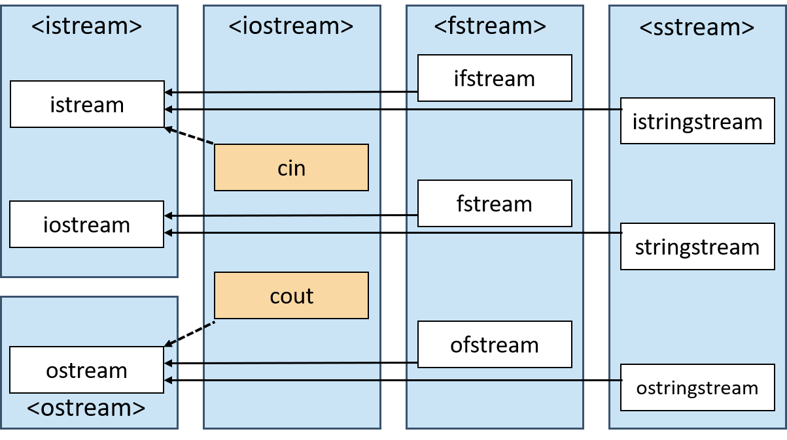
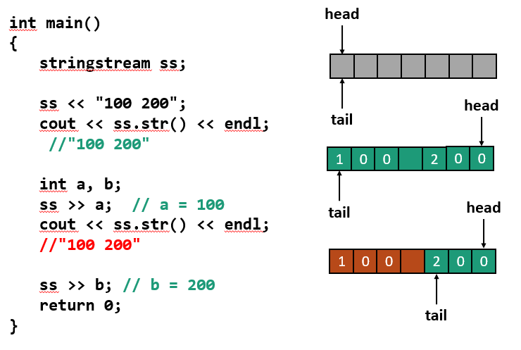

# STL与字符串处理

## Abstract
- string字符串类
- iostream输入输出流
- 字符串处理与正则表达式

## string 字符串类

```cpp
// Construct
string s0("Initital string");
string s1;
string s2(s0, 8, 3);    // src_str, start_idx, len
string s3("Another character sequence", 12);    // intercept first 12 chars
string s4(10, 'x');
string s5(s0.begin(), s0.begin()+7);

// convert to C style string(const char*)
const char* s = str.c_str();

// common funcs
cout << str[1];

int len = str.size();
int len = str.length();

str.clear();
if(!str.empty());

for(char c: str);

str.push_back('a');
str += 'a';

str.append(s2);
str += s2;

// input
cin >> firstname;   // read chars that can be seen until whitespace
getline(cin, fullname);
getline(cin, fullnames, '#');   // read until separator

// merge
string fullname = firstname + " " + lastname;   
// notice the time complexity will be the length of the generated string
// BEST USE operator+= or stringstream

// comparison
a == b;
a < b;

// num to string
to_string(1) == "1";
to_string(3.14) == "3.14";
to_string(3.1415926) == "3.141593"; // notice the precision lose
to_string(1+2+3) == "6";

// string to num
int a = stoi("2001");
std::string::size_type sz;
int b = stoi("50 cats", &sz);   // b=50, sz=2, the length of the num is read into var sz
int c = stoi("40c3", nullptr, 16);   // c = 0x40c3  hex
int d = stoi("0x7f", nullptr, 0);    // d = 0x7f  automatically induce the base
double e = stod("34.5");

```

## iostream 输入输出流

> What the hell is ostream?



### 从 ostream 和 cout 开始

#### ostream
ostream是stl库中所有**输出流**的**基类**  
它重载了针对基础类型的输出流运算符 <<

#### cout
cout 是STL中内建的一个ostream对象

它会将数据送到**标准输出流**(usually the screen)

### Make your own ostream

> 哪个男孩不想拥有自己的ostream呢？

```cpp
class ostream
{
public:
    ostream& operator<<(char c)
    {
        printf("%c", c);
        return *this;
    }
    ostream& operator<<(const char* str)
    {
        printf("%s", str);
        return *this;
    }
}cout;

int main(){
    cout << "hello" << ' ' << "world";
    return 0;
}
```

实现原理：<<运算符为**左结合**

### 格式化输出

\#include \<iomanip\>  // input \ output manipulation

cout << **fixed** << 2018.0 << " " << 0.0001 << endl;  
				//浮点数 -> 2018.000000 0.000100  
cout << **scientific** << 2018.0 << " " << 0.0001 << endl;  
				//科学计数法 -> 2.018000e+03 1.000000e-04  
cout << **defaultfloat**;  //还原默认输出格式  
cout << **setprecision(2)** << 3.1415926 << endl;  
				//输出精度设置为2 -> 3.2  
cout << **oct** << 12 << " " << **hex** << 12 << endl;   
				//八进制输出 -> 14  十六进制输出 -> c  
cout << **dec**;	//还原十进制  
cout << **setw(3)** << **setfill('*')** << 5 << endl;  
				//设置对齐长度为3，对齐字符为* -> **5  

**fixed scientific setprecision** 等都是 **流操纵算子**，大致分为两种：不带参数（规范有定义）、带参数（规范无定义）

### 流操纵算子 stream manipulator

借助辅助类设置成员变量

setprecision(2)是一个类的对象

一种实现方式的示例：
```cpp
class setprecision
{
private:
    int precision;
public:
    setprecision(int p) : precision(p) {}
    friend class ostream;
};

class ostream
{
private:
    int precision;
public:
    ostream& operator<<(const setprecision &m){
        precision = m.precision;
        return *this;
    }
} cout;
```

#### endl

> C++标准中endl的声明：ostream& endl(ostream& os);

endl 是一个函数，可以调用endl(cout);
```cpp
ostream& endl(ostream& os) {
    os.put('\n');
    os.flush();
    return os;
}
```
它同时又是一个流操纵算子 cout << endl;
```cpp
//实现方式示例
ostream& operator<< (ostream& (*fn)(ostream&)) {    // 流运算符重载，函数指针作为参数
    return (*fn)(*this);
}
```

#### cout

> 不能复制

重载流运算符需要返回**引用**，避免复制

```cpp
ostream(const ostream&) = delete;
ostream(ostream&& x);
```
**禁止复制，只允许移动**

仅使用cout一个全局对象
- 避免复制开销
- 一个对象对应一个标准输出，符合oop思想
- 多个对象之间**无法同步输出状态**

## 文件输入输出流

> 以文件输入流为例子

ifstream是istream的子类，功能是从文件中读入数据

```cpp
ifstream ifs("input.txt");
ifstream ifs("binary.txt", ifstream::binary);

ifstream ifs;
ifs.open("file");
// do something
ifs.close();
```

Example

```cpp
#include <iostream>
#include <string>
#include <cctype>
#include <fstream>
using namespace std;

int main() {
    ifstream ifs("input.txt");
    while(ifs) {			//判断文件是否到末尾 利用了重载的bool运算符
        ifs >> ws;  		//除去前导空格 ws也是流操纵算子
        int c = ifs.peek();		//检查下一个字符，但不读取
        if (c == EOF) break;
        if (isdigit(c))			//<cctype>库函数
        {
            int n;
            ifs >> n;
            cout << "Read a number: " << n << endl;
        } else {
            string str;
            ifs >> str;
            cout << "Read a word: " << str << endl;
        }
    }
}
```

其他操作
```cpp
getline(ifs, str);

char c = ifs.get();
ifs.ignore(int n=1, int delim=EOF); // omit n chars, or until delim separator
char c = ifs.peek();
ifs.putback(c);
ifs.unget();
```

## 字符串输入输出流

> 以输入输出流为例子

**stringstream**是**iostream**的子类  
**iostream**继承于**istream**和**ostream**  
// 多重继承！  
**stringstream**实现了输入输出流双方的接口

### stringstream

- 在对象内部维护了一个buffer
- 使用流输出函数可以将数据写入buffer
- 使用流输入函数可以从buffer中读入数据
- **一般用于程序内部的字符串操作**

```cpp
stringstream ss;
stringstream ss(str);
```

#### What can it do?

- 连接字符串
- 将字符串转换为其他类型的数据
- 配合流操作算子达到格式化输出效果

#### 获取stringstream的buffer



#### 实现一个类型转换函数

```cpp
template<class outtype, class intype>
outtype convert(intype val)
{
	static stringstream ss;
						//使用静态变量避免重复初始化
	ss.str(""); 	//清空缓冲区
	ss.clear(); 	//清空状态位（不是清空内容）
	ss << val;
	outtype res;
	ss >> res;
	return res;
}
```

