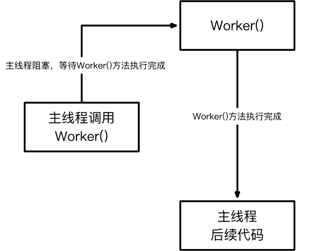
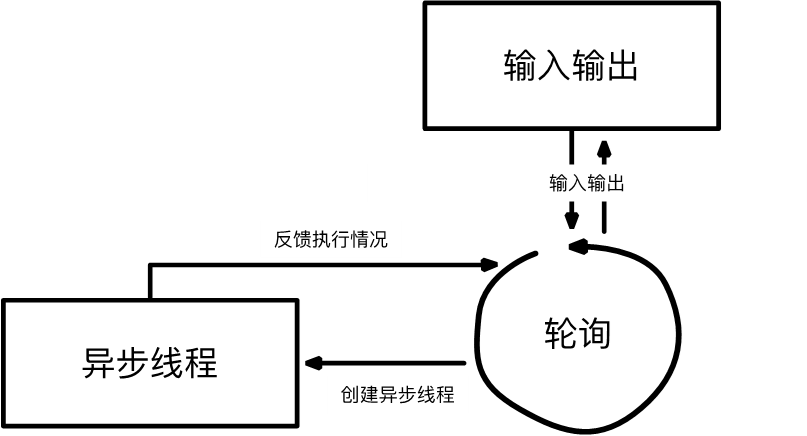

# 并发编程与并发设计模式

## Abstract
- 并发编程
- thread与主从模式
- mutex与互斥锁模式
- async,future,promise与异步

## 并发编程

### “并发”与“并行”
- **一个时间段内**几个程序都处于启动到完成之间：**宏观上***同时*
- “并发”：任意时刻**只有一个程序**在计算单元上运行：**微观上***顺序执行*
- “并行”：任意时刻**可以有多个程序**运行：**微观上**也可以是*同时*

并发、并行都是**多任务**环境下的系统

### “进程”与“线程”

**进程 process**  
- 已运行的程序
  
**线程 thread**  
- 是操作系统能够进行**运算调度**的**最小单位**
- 它被包含在进程之中，是进程中的实际运作单位
- **一个进程**可以**并发多个线程**，设备允许的情况下，数个线程可以并行执行不同的任务
- 同一进程的多条线程**共享**该进程的全部**系统资源**，如虚拟地址空间，文件描述符和信息处理等

## thread与主从模式

### thread 类
示例：code/thread.cpp
- **默认构造函数**   
  定义：  
  `thread() noexcept;`  
  创建一个空线程对象，不代表任何可执行的线程  
  例：`thread s1;`
- **初始化构造函数**  
  定义：  
  ```
  template <class Fn, class ... Args> 
  explicit thread (Fn&&, Args&& ... args);
  ```
  注意：线程一旦创建，线程就开始执行
  - 可以与可调用对象（Callable Objects）一起使用
  - 如 Lambda 表达式
  - ```cpp
    thread t(
      [] (int a,int b) {
        cout << a + b << endl;
      }.
      1, 2);
      t.join();
    ```
- **拷贝构造函数**  
  **被禁用**，因为thread不可被拷贝构造（线程涉及系统底层）
- **移动构造函数**  
  定义：  
  `thread (thread&& x) noexcept;`
  有默认的移动构造函数，调用成功后x不指向任何具体执行线程

### join detach
thread提供了两种接口来处理当前线程与目标线程

- **thread::join()**  
  调用该接口时，当前线程会一直阻塞，直到目标线程执行完成
- **thread::detach()**
  - 调用此接口时，目标线程成为守护线程（daemon threads），将完全独立执行
  - 即使目标线程对应的thread对象被销毁也不影响线程的执行

### joinable
thread::joinable() 可以判断 thread实例指向的线程是否可以 join 或者 detach

三种情况下thread实例不是joinable：
- 默认构造函数创建的实例（不指向任何具体的执行线程）
- 被移动构造函数操作过的实例
- 已经调用过join()或者detach()的实例

启动目标线程后，必须决定当前线程是要等待目标线程结束（join），还是让目标线程独立（detach），**必须二选一**

如果目标线程的thread对象销毁时依然没有调用join或者detach，thread对象在析构时将导致程序进程异常退出

即thread**析构时必须是非joinable的状态**

### 相关功能性接口

- `this_thread::get_id`
- `this_thread::sleep_for`
- `this_thread::sleep_until`
- `this_thread::yield`

### 主从模式

示例：code/thread_prime.cpp


适用场景
- 整体任务可以被划分为诸多子任务
- 子任务间关联较弱，可以并发执行
- 计算设备支持多任务同时执行

## mutex与互斥锁模式

示例二：修改示例一：让每个子线程直接修改全局变量total

出错！

### 竞争条件与临界区

- 竞争条件  
  - 多个线程同时访问共享数据时，只要有一个任务修改数据，那么就可能会发生问题——多个线程同时争相修改数据，导致部分修改没有成功。这种场景称为**竞争条件（race condition）**
- 临界区  
  - 访问共享数据的代码片段称为**临界区（critical section）**，如示例中的total++;
- 避免竞争条件需要对临界区进行数据保护  
  - 一次只能让一个线程访问共享数据
  - 访问完了再让其他线程接着访问

### 互斥量mutex与锁lock()

互斥量mutex本身是一个类对象，一般也成为“锁”

- 各个线程可以**尝试用mutex的lock()接口**对临界区数据进行加锁
  - 每次只有一个线程能够锁定成功，标志是lock()成功返回
  - 如果没锁成功，则线程会阻塞在那里
  - 临界区**就像一间只能反锁的房间**
- mutex的unlock()接口可以解锁互斥量

实现方法（示例二）：
```cpp
// 全局变量
static mutex exclusive;

// 方法一：直接在total++;周围上锁
if(check_num(i)) {
  exclusive.lock();
  total++;
  exclusive.unlock();
}

// 方法二： 每个线程各自统计完之后再加入total
for (...) if(check_num(i)) tmp_total++;
exclusive.lock();
total+=tmp_total;
exclusive.unlock();

// 方法二效率更高，因为锁的开关需要时间，方法二的锁的调用次数更少
```

#### 互斥锁模式的弊端

- 低效——共享资源的读操作往往并不需要互斥
- 解决方案——采用**读写锁模式**，读是共享，写是互斥

### 其他互斥量

- timed_mutex
- recursive_mutex
- recursive_timed_mutex
- shared_mutex

## async、future、promise 与 异步

**案例三：** 需求：不断输入整数n,判断n是否为素数 async_prime.cpp

能否让输入不受判断方法的阻塞？

### 同步和异步

- **同步（Synchronous）**  
  同步调用一旦开始，调用者必须等到调用返回结果后才能继续后续的行为
  
  
- **异步（Asynchronous）**  
  异步调用一旦开始，被调用方法就会立即返回，调用者可以无阻塞继续后续的操作

  被调用方法通常会在另外一个线程中默默运行，整个过程，不会阻碍调用者的工作

  被调用方法完成后可以通过特殊机制传递信息给调用者

  

### async

```cpp
future async (Fn&& fn, Args&&...args);
future async (launch policy, Fn&& fn, Args&&...args);
```

async会返回一个future对象，用来存储异步任务的执行状态和结果

policy有三种选择
- launch::async 保证异步行为，执行后，系统创建一个线程，执行对应的函数
- launch::deffered 表示延迟调用，在调用future中的wait()或者get()函数时，才执行入口函数
- launch::async||launch::deffered 默认策略，由系统自行决定怎么调用

### future

future类提供访问异步操作结果的接口
- **wait()** 接口，阻塞当前线程，等待异步线程结束
- **get()** 接口，获取异步线程执行结果
  - 需要注意的是，**future对象只能被一个线程获取值**，并且在调用get()之后就没有可以获取的值了
  - 如果多个线程调用同一个future实例的get()会出现数据竞争，其结果是未定义的
  - 调用get()如果异步线程没有结束会一直等待，类似wait()
- **wait_for(timeout_duration)** 如果在制定超时间间隔后仍然没有结束异步线程，则**返回目标线程当前状态**，并**取消wait_for的阻塞**
  - future_status::deferred 仍未启动
  - future_status::ready 结果就绪
  - future_status::timeout 已超时限，异步线程仍在执行

### 使用async和future完成案例三

构建运算不阻塞输入的程序：
- 使用异步线程进行运算
- 使用主线程进行状态管理
- 主线程**不断检查**输入状态和异步线程的执行状态：有输入立刻创建新的异步线程进行处理；某一个异步线程完成后，立刻输出处理结果

这种不断消耗极短时间进行检测的方式就是**轮询**

### 轮询



### promise

一般流程
- 在当前线程中创建promise对象，并从该promise对象中获得对应的future对象
- 将promise对象传递给目标线程，目标线程通过promise的接口设置特定值，**然后可以继续执行目标线程自身的工作**
- 在特定时间，当前线程按需求通过promise对应的future取值
