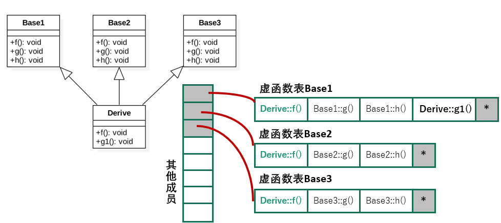

# 多态与模板

## Abstract

- 纯虚函数与抽象类
- 向下类型转换
- 多重继承的虚函数表，多重继承的利弊
- 多态
- 函数模板与类模板

## 纯虚函数

虚函数 可进一步声明为 纯虚函数， 包含纯虚函数的类叫做“抽象类”

`virtual ReturnType FuncName(Parameters) = 0;`

可在类外定义函数体提供默认实现，派生类通过Base::f() 调用

抽象类不允许定义对象，定义基类为抽象类的主要目的是为派生类规定共性“接口”

## 抽象类

Definition: Have at least one pure virtual function.

Features:
- Defining objects is not allowed.
- Can only provide IO for derived class.
- Can avoid object slicing: Ensuring only pointers and references can be converted into upper type.

Example:  
- Shape
- - Shape2D
- - - Circle
- - - Triangle
- - - Rectangle
- - Shape3D
- - - Sphere
- - - Cube
- - - Tetrahedron

Code Example:
```cpp
class Pet { 
public:  
  virtual void motion()=0;
};
void Pet::motion(){ cout << "Pet motion: " << endl; } 
class Dog: public Pet { 
public: 
  void motion() override {Pet::motion(); cout << "dog run" << endl; } 
};
class Bird: public Pet {
public: 
  void motion() override {Pet::motion(); cout << "bird fly" << endl; } 
};
int main() {
  Pet* p = new Dog; /// 向上类型转换
  p->motion();
  p = new Bird; /// 向上类型转换
  p->motion();
  //p = new Pet; /// 不允许定义抽象类对象
  return 0;
}
```
>Output:  
Pet motion:  
dog run  
Pet motion:  
bird fly  

- 基类纯虚函数被派生类重写覆盖之前仍是纯虚函数。因此当继承一个抽象类时，必须**实现** **所有** 纯虚函数，否则继承出来的类仍然是抽象类
- 纯虚析构函数除外

### 纯虚析构函数

>回顾：  
析构函数可以且常常是虚的，仍需定义函数体，用途是：当删除基类对象指针时，编译器将根据指针所指对象的**实际类型**，调用相应的析构函数

析构函数也可以是纯虚构函数

- 仍然需要函数体
- 目的：使基类成为抽象类，不能创建基类的对象。如果有其他函数是纯虚函数，则析构函数不必是纯虚的。

*// Comment: 我想纯虚函数/抽象类的目的在于**强迫对派生类进行各自的实现**，而不依赖基类（抽象）的实现*

**对于纯虚析构函数而言**，即便派生类中不显式实现，**编译器也会自动合成默认析构函数**。因此即便派生类不覆盖纯虚析构函数，它也可以不是抽象类，可以定义派生类对象。


## 向下类型转换

基类指针/引用  --->  派生类指针/引用

### Why 向下类型转换？

- 向上转换：**保留共性**；向下转换：**表现特性**

- 比如可以使用基类指针数组对各种派生类对象进行管理，当具体处理时可以将其转换为实际的派生类指针，进而调用派生类专有的接口

### 如何保证转换的正确性？

借助虚函数表进行**动态类型检查**

### dynamic_cast 安全类型的向下显式类型转换

使用dynamic_cast的对象**必须有虚函数**

#### Usage
```cpp
// T1* obj_p;
// T1& obj_r;
T2* pObj = dynamic_cast<T2*>(obj_p);
// 失败时返回nullptr
T2& refObj = dynamic_cast<T2&>(obj_r);
// 失败时抛出bad_cast异常
```

T1必须是多态类型（声明或继承了至少一个虚函数的类），T2不必。

若两者没有继承关系，也能通过编译，但运行时会转换失败。

### static_cast 用于避免 确认类型 带来的开销

编译时静态浏览类层次，只检查继承关系。没有继承关系的类之间必须有转换途径（略）。运行时无法确认是否正确转换

```cpp
T2* pObj = static_cast<T2*>(obj_p);
T2& refObj = static_cast<T2&>(obj_P);
// 不安全！
```
### dynamic与static比较
相同：都可以完成向下类型转换  
不同：
- static_cast是在**编译时静态**执行向下类型转换
- dynamic_cast会在**运行时**检查被转换的对象**是否确实是正确的派生类**。额外的检查需要RTTI（Run-Time Type Information），因此要比static_cast慢一些，但是更安全。

**一般使用dynamic_cast进行向下类型转换**

---

### 重要原则（清楚指针所指向的真正对象）：
1. 指针或引用的向上转换总是安全的
2. 向下转换时用dynamic_cast，安全检查
3. 避免**对象之间**的转换

### 向上向下类型转换与虚函数表

对于基类中有虚函数的情况：

- 向上类型转换  
  转换为基类**指针或引用**，则对应虚函数表仍然为派生类的虚函数表（晚绑定）  
  转换为基类**对象**，则对应虚函数表是基类的虚函数表（早绑定）  
- 向下类型转换  
  dynamic_cast通过虚函数表来判断是否能进行向下类型转换

---
Example
```cpp
class Pet { public:  virtual ~Pet() {} };
class Dog : public Pet { 
public: 	void run() { cout << "dog run" << endl; }
};
class Bird : public Pet {
public: 	void fly() { cout << "bird fly" << endl; }
};

void action(Pet* p) {
	auto d = dynamic_cast<Dog*>(p);	/// 向下类型转换
	auto b = dynamic_cast<Bird*>(p);	/// 向下类型转换
	if (d) /// 运行时根据实际类型表现特性
		d->run();
	else if(b)
		b->fly();
}

int main() {
	Pet* p[2];
	p[0] = new Dog; /// 向上类型转换
	p[1] = new Bird; /// 向上类型转换
	for (int i = 0; i < 2; ++i) {
		action(p[i]);
	}
	return 0;
}
```

## 多重继承

### 多重继承的虚函数表

多重继承会有多个虚函数表，几重继承，就会有几个虚函数表。这些表按照派生的顺序依次排列。

如果子类改写了父类的虚函数，那么就会用子类自己的虚函数覆盖虚函数表的相应位置，**如果子类有新的虚函数，那么就添加到第一个虚函数表的末尾。**




### 利弊

略，见前课件

Best Practice:
- 最多继承一个非抽象类（is-a)
- 可以继承多个抽象类（接口）

Why?
- 避免 多重继承的二义性
- 利用 一个对象实现多个接口

---
Example
```cpp
class WhatCanSpeak {
public:
	virtual ~WhatCanSpeak() {}
	virtual void speak() = 0;  };
class WhatCanMotion {
public:
	virtual ~WhatCanMotion() {}
	virtual void motion() = 0;   };
class Human : public WhatCanSpeak, public WhatCanMotion
{
	void speak() { cout << "say" << endl; }
	void motion() { cout << "walk" << endl; }
};

void doSpeak(WhatCanSpeak* obj) { obj->speak(); }
void doMotion(WhatCanMotion* obj) { obj->motion(); }
int main()
{
	Human human;
	doSpeak(&human); doMotion(&human);
	return 0;
}
```

### 虚拟继承
自行了解

## 多态(Polymorphism)

产生多态效果的条件： 继承 && 虚函数 && （引用 || 指针）

好处：
- 通过基类定好接口后，不必对每一个派生类特殊处理，只需要调用抽象基类的接口即可。大大提高程序的**可复用性**
- 不同派生类对同一接口的实现不同，能达到不同的效果，提高了程序**可拓展性和可维护性**

示例见课件

### 应用：TEMPLATE METHOD设计模式

- 在接口的一个方法中定义算法的骨架
- 将一些步骤的实现延迟到子类中
- 使得子类可以在不改变算法结构的情况下，重新定义算法中的某些步骤

```cpp
class Base{
public:
    void action() {
        step1();
        step2();
        step3();
    }
    virtual void step1() { 
        cout << "Base::step1" << endl; 
    }
    virtual void step2() { 
        cout << "Base::step2" << endl; 
    }
    virtual void step3() { 
        cout << "Base::step3" << endl; 
    }
};

class Derived1 : public Base{
    void step1() { 
        cout << "Derived1::step1" << endl; 
    }
};
class Derived2 : public Base{
    void step2() { cout << "Derived2::step2" << endl; }
};

int main(){
    Base* ba[] = {new Base, new Derived1, new Derived2};
    for (int i = 0; i < 3; ++i) {
        ba[i]->action();
        cout<<"==="<<endl;
    }
    return 0;
}
```

> Output:  
Base::step1  
Base::step2  
Base::step3  
===  
Derived1::step1  
Base::step2  
Base::step3  
===  
Base::step1  
Derived2::step2  
Base::step3  
===  

## 函数模板与类模板

模板
- 函数模板
- 类模板
- 成员函数模板

### 函数模板

`template <typename T> ReturnType Func(Args);`

`template <class T> ReturnType Func(Args);`

在调用时编译器自动推导出实际参数的类型

```cpp
template <typename T>
T sum(T a,T b){return a+b;}

cout << sum(9,2.1);   //编译错误，参数类型不一致，无法推导
cout<< sum<int>(9,2.1); //手工指定类型
```

### 类模板

```cpp
template <typename T> class A{
  T data;
public:
  void print1(){cout << data << endl;}
  void print2();      // 类外定义
};

template<typename T>    // 类外定义
void A<T>::print2() {cout << data << endl;}

int main(){
  A<int> a;
  a.print1();
}

```

“模板参数”
- 类型参数： typename或class
- 非类型参数： 整数，枚举，指针（指向对象或函数），引用（引用对象或函数）。
  ```cpp
  template<typename T, unsigned size>
  class array{
    T elems[size];
    ...
  };
  
  array<char, 10> array0;
  ```
### 成员函数模板

普通类
```cpp
class normal_class {
public:
  int value;
  template<typename T> void set(T const& v) {
    value = int(v);
  }   /// 在类内定义
  template<typename T> T get();
};

template<typename T>    /// 在类外定义
T normal_class::get() {
  return T(value);
}
```
模板类
```cpp
template<typename T0> class A{
  T0 value;
public:
  template<typename T1> void set(T1 const& v){
    value = T0(v);
  }     /// 类内定义
  template<typename T1> T1 get();
};
template<typename T0> template<typename T1>
T1 A<T0>::get(){ return T1(value);}   // 类外定义

/*注意不能写成
template<typename T0, typename T1>
T1 A<T0>::get(){ return T1(value);}   // 类外定义
*/
```

模板使用中通常可以自动推导类型，必要时也可以指定，方法是在调用的东西的名称后加上 <类型名>

### 模板原理

在编译期进行对模板的处理，这意味着所有模板参数必须在编译期确定，不能使用变量

这意味着

模板库必须在头文件中实现，不可以分开编译

### 模板与多态

模板也是多态，只不过是**静**多态（编译时）
